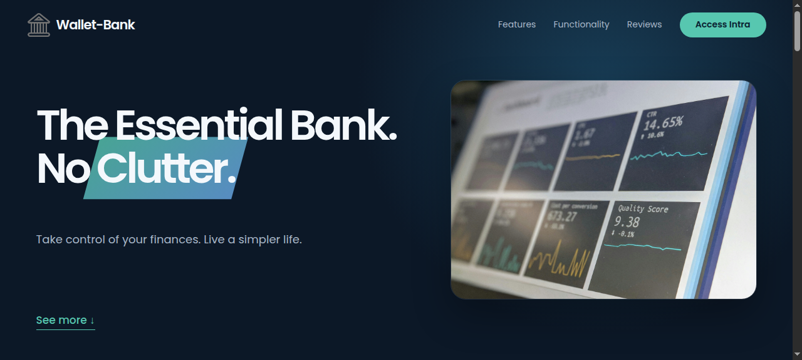

<div align="center">

# Wallet-Bank

### A focused banking dashboard for everyday account management.


</div>

## Overview

Wallet-Bank is a lightweight, browser based banking demo built with semantic HTML, modern CSS, and vanilla JavaScript modules. It includes a public landing page and a working account dashboard for reviewing movements, transferring money, requesting a loan, sorting transactions, and closing an account.

The project runs entirely in the browser. There is no backend, build step, or dependency installation required.

## Learning project

<div align="center">

<p>I built Wallet-Bank while learning vanilla JavaScript. The project was used to practice DOM manipulation, events, form handling, array methods, modules, browser storage concepts, and interactive UI patterns without a framework.</p>

</div>

## Screenshots

<div align="center">



</div>

## Features

- Responsive marketing page with smooth navigation, lazy loaded images, sticky navigation, tabs, and testimonials slider.
- Account login with two demo profiles and locale aware currency formatting.
- Transaction history with deposits, withdrawals, relative dates, and sorting.
- Transfers between demo accounts with balance validation.
- Loan requests with a simple eligibility check.
- Account closure flow and automatic inactivity logout timer.

## Demo accounts

| Username | PIN | Currency |
| --- | ---: | --- |
| `ab` | `1111` | GBP |
| `jd` | `2222` | USD |

## Run locally

Because the dashboard uses JavaScript modules, serve the repository through a local HTTP server.

```bash
git clone https://github.com/Abdelkrim7Be/Wallet-Bank.git
cd Wallet-Bank
python3 -m http.server 8000
```

Open [http://localhost:8000/](http://localhost:8000/) for the Wallet-Bank landing page. The dashboard is available from the navigation or directly at [http://localhost:8000/Managing_Account_Part/](http://localhost:8000/Managing_Account_Part/).

## Project structure

```text
index.html               Root route for the Wallet-Bank landing page
Managing_Account_Part/   Account dashboard and banking interactions
img/                     Landing page and shared brand imagery
screenshots/             README screenshots captured from the running app
```

## Notes

This is a frontend demo. Account data and credentials are stored in `Managing_Account_Part/data.js`, so the application should not be used for real financial information.

## License

Released under the MIT License.
